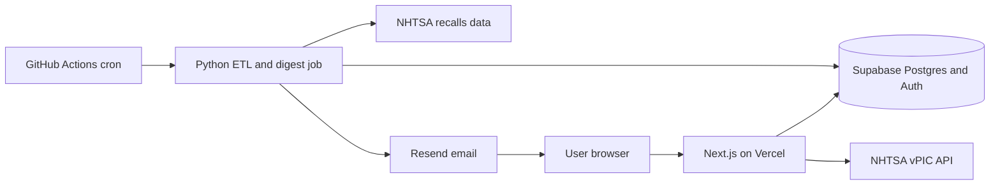
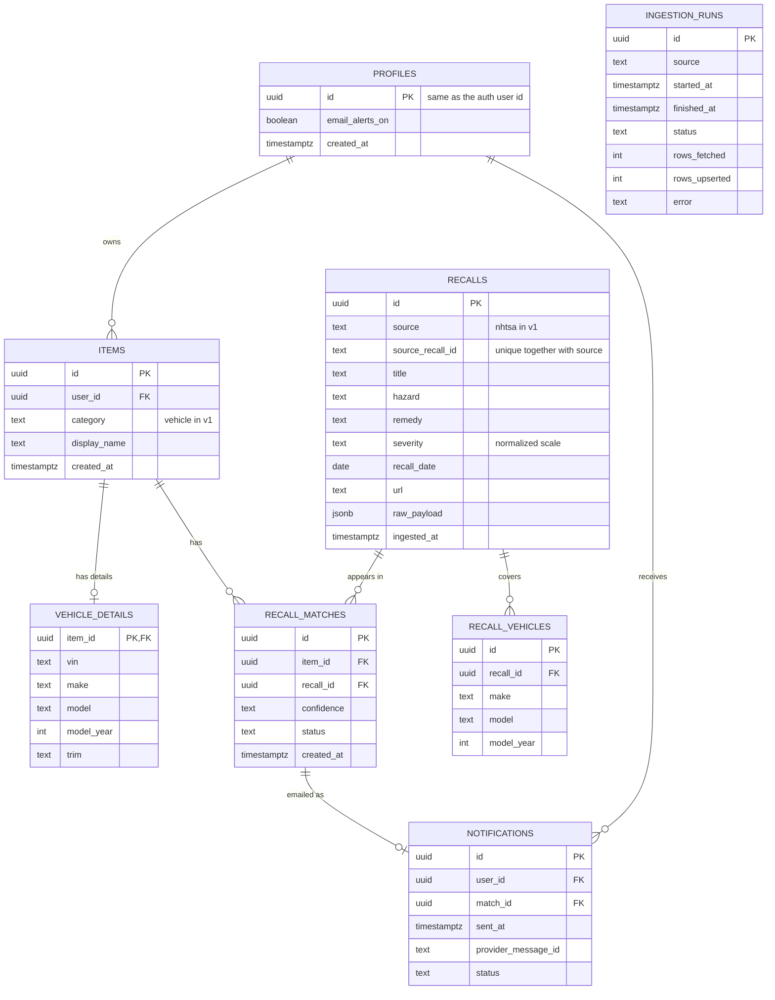
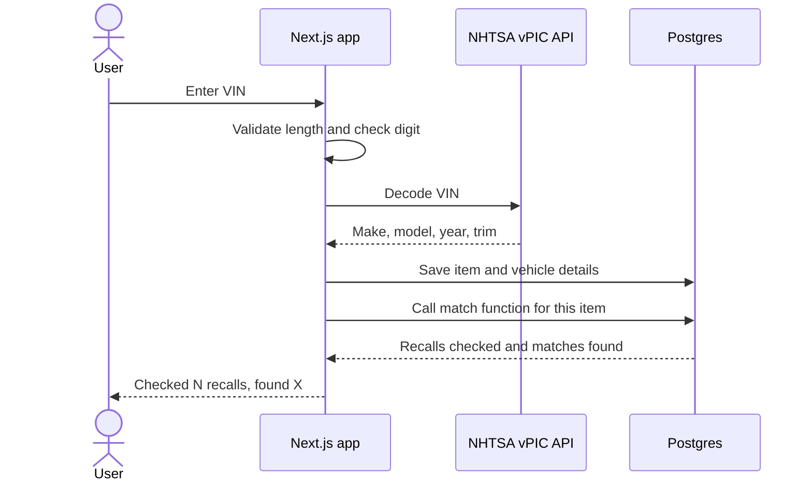
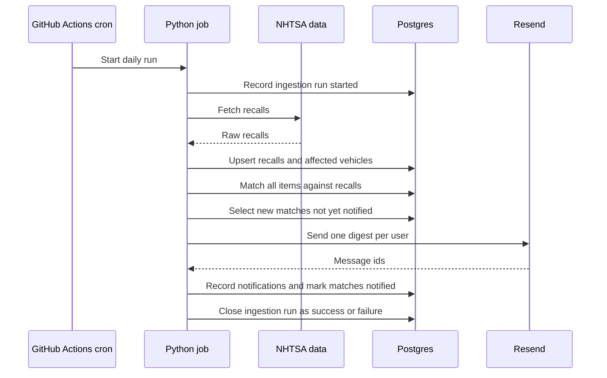

# Recall & Safety Alert Aggregator: Project Plan

**Status:** Draft for kickoff. Everything marked **VERIFY** is my understanding of an external fact and must be confirmed in a spike before we build on it.
**Team:** Two people, both novices at building full apps, working asynchronously across a 12.5-hour time difference. 50/50 ownership.
**Written by:** Claude acting as project lead. You two own this document and can change any of it.

---

## 0. One-page summary

**What we're building:** A web app where you register what you own, starting with vehicles by VIN, and get emailed only when a new recall plausibly applies to you. Today you would check several government sites by hand.

**Decided so far**
- MVP (v1) is **vehicles only**. Baby products come in v2.
- The work is split in half and **fixed for this project**. One person owns the **Data side** (Python, SQL). One owns the **Users side** (TypeScript, Next.js). On the next project we swap.
- No deadlines and no hour commitments. We use a light rhythm (2-week cycles, a weekly status post, one call every two cycles) so the project doesn't drift.
- Free tiers first. Portfolio piece first, real users second.

**Versions**

| Version | Contents | What it proves |
|---|---|---|
| **v1 (MVP)** | Vehicles: NHTSA recalls, VIN decode, dashboard, daily job, email digest | The whole pipeline works end to end |
| **v2** | Consumer products (CPSC), baby gear, car seats, manual entry, fuzzy matching, measured match precision | Portfolio-ready |
| **v3** | FDA devices | New source on a proven pattern |
| **v4** | FDA drugs | Lot codes and stronger disclaimers |
| **v5** | FDA food | Weakest matching, so it comes last |
| **v6** | Public launch | Domain, email authentication, legal review, beta |

**The three things that make or break a first team project**
1. **Write the contract first.** The database schema and function signatures are the only thing the two sides share. We agree on them in writing before either side builds against them.
2. **Keep changes small and reviewed.** Small PRs, reviewed within 3 days, with a written handoff note after every work session.
3. **Spike before you commit.** Anything we're unsure about gets a short, time-boxed experiment first (Section 6.7).

---

## 1. Project definition

### 1.1 Concept
Register what you own (vehicles by VIN, later baby gear, appliances, medical devices, medications, pantry items). The system ingests recall data from NHTSA, CPSC, and FDA every day, matches it against your saved items, and emails you only when something applies. A dashboard shows active recalls with severity, date, and a source link.

### 1.2 Goals
1. Learn to build and ship a full-stack app as a two-person team.
2. Produce a portfolio piece with a real engineering story: ingesting, normalizing, and matching messy public data.
3. Stay simple enough to deploy, and allow real users after the MVP.

### 1.3 Non-goals (parked)
Barcode scanning, web push notifications, household sharing, browser extension "check before buying", mobile app, non-US data.

### 1.4 Constraints
- Both new to team development. Solo experience only.
- Basic Python. Little or no SQL, TypeScript, React/Next.js, auth, deployment, or CI.
- No overlapping working hours, so everything important gets written down.
- Free tiers at first. US-only data sources.

---

## 2. Version map

### v1 (MVP): Vehicles only
- Sign up and log in
- Save a VIN, decode it via NHTSA vPIC (make, model, year, trim)
- Ingest NHTSA recalls
- Match on make, model, and year, using a plain SQL query
- Dashboard: active recalls with severity, date, and source link, plus a link out to NHTSA's official VIN lookup
- Daily scheduled ingestion, with ingestion logs and failure alerts
- Email digest: at most one per day, new matches only, no double-sends
- Unsubscribe, account deletion, row-level security (RLS) review, disclaimer and privacy basics

**Done when:** a stranger can sign up, save a VIN, and see recalls that apply to their model and year, with a clear disclaimer that the match is model-level and not VIN-level. The system also runs a week untouched and emails only new matches.

### v2: Consumer products (CPSC)
- Manual product entry (name, brand, model, category)
- CPSC ingestion, fuzzy matching (Postgres pg_trgm or Python, decided by a spike), confidence tiers: Confirmed, Likely, Possible
- Car seats (NHTSA equipment recalls, **VERIFY** that they aren't CPSC)
- A hand-labeled test set of about 50 item/recall pairs, an evaluation script, and a measured precision number
- Shared severity scale (critical, high, medium, info) with a mapping table
- Users-side extras that balance the workload: a match-review page for labeling, and dashboard filters and confidence badges

**Done when:** match precision is measured and documented, and we've set our own threshold for what gets emailed. This is the portfolio-ready version.

### v3: FDA devices
Medical devices such as CPAP machines, glucose monitors, and hearing aids. Reuses the v2 form and matcher. New work: the openFDA device adapter and severity mapping (FDA Class I/II/III).
**Warning:** many device recalls target hospitals, and users often don't know their model number. This is not automatically easier than the others.

### v4: FDA drugs
Adds lot-code display ("this recall covers lots X and Y, check your bottle") and a stronger disclaimer. Stores name and brand only, never dose or condition.

### v5: FDA food
Weakest matching because there are rarely UPCs or lot codes to match on. This comes last, and each of v3 to v5 is independent and can be reordered.

### v6: Public launch
Domain, email authentication (SPF/DKIM/DMARC), legal pages, onboarding, private beta, and a move off free tiers if needed. Get real legal advice on the health-data categories (drugs and devices) before opening to the public.

### Definitions
- **MVP** = v1
- **Portfolio-ready** = through v2, ideally v3
- **Full scope** = through v5

**Never cut in any version:** the labeled test set (from v2 on), the RLS review, and the disclaimers.

---

## 3. Roles and responsibilities (fixed split)

Roles are assigned at kickoff. Nothing below depends on who takes which.

### Data side (Python, SQL)
- Source adapters (fetch, store raw payload, normalize), one per recall source
- Tables: `recalls`, `recall_vehicles`, `recall_matches`, `notifications`, `ingestion_runs`
- Matching logic (SQL function in v1), severity mapping
- Labeled test set and evaluation script (from v2)
- Scheduled job (GitHub Actions), failure alerts, logging
- Digest email job: selects new matches, batches per user, sends, records what was sent
- **Steward: schema and migrations.** Reviews every database change and every security policy.

### Users side (TypeScript, Next.js)
- Auth flows, signup, login, logout
- Tables: `profiles`, `items`, `vehicle_details`
- VIN form with validation, and the vPIC decode call (see decision D12)
- Dashboard, recall detail page, empty and error states
- Email templates (HTML and plain text), settings page, unsubscribe, account deletion
- Deployment (Vercel or fallback)
- **Steward: repo and deploy.** Owns CI, secrets handling, hosting settings, docs folder structure.

### Shared (both, always)
- Schema changes (both approve), RLS policies (both review), decision log, README, OWNERSHIP.md, the write-up, and the labeling of the test set.

### Known imbalances
- **The Users side is the steeper climb.** It is a new language, a new framework, and auth. Choose deliberately who takes it.
- **The Data side grows with every FDA version** because each adds an adapter, while the Users side has little new to build. To even it out, v2 gives the Users side the match-review page and dashboard filters, and v6 gives it public readiness.

### Keeping two halves from becoming two silos
- Review every PR on the other side, even if you only partly understand it. Ask questions in the review.
- At the end of each version, each person records a 10 to 15 minute screen walkthrough of their half.
- Both of you should be able to explain the whole system in an interview.

### Contract between sides
Before each stage starts, the sides agree on and write down, in `docs/contracts/`:
- The tables and columns each side reads or writes
- Function signatures, for example `match_item_to_recalls(item_id uuid) -> int`
- Fake data: the Data side provides sample recall data so the Users side isn't blocked. The Users side provides sample vehicles, including tricky ones, so the Data side isn't blocked.

---

## 4. Architecture and data

### 4.1 Stack
| Piece | Choice | Notes |
|---|---|---|
| Database and auth | Supabase Postgres with built-in auth and row-level security | Vendor lock-in is the tradeoff. Free projects may pause after inactivity (**VERIFY**) |
| Frontend | Next.js + TypeScript | Hosting: Vercel first. Its free Hobby plan is for one person and non-commercial use (**VERIFY**), so pick a fallback such as Netlify or Cloudflare Pages |
| ETL, matching orchestration, digest job | Python | |
| Scheduling | GitHub Actions cron | Free, no function timeouts, runs Python. Scheduled workflows may be disabled after about 60 days without repo activity (**VERIFY**), which can silently stop the job |
| Email | Resend (or SendGrid) | Sending from your own domain needs SPF/DKIM/DMARC. Check the free-tier limits |

### 4.2 Repo layout (one monorepo)
```
recall-aggregator/
  web/                 Next.js app (Users side)
  etl/                 Python ingestion, matching, digest (Data side)
  db/migrations/       Schema as code (Data side stewards)
  docs/                Decisions, design docs, contracts, spikes, meeting notes
  .github/workflows/   CI and scheduled jobs
  README.md            How to run everything, tested by the other person
  OWNERSHIP.md         Ownership and leaving terms
  .env.example         Names of required secrets, never values
```

### 4.3 System overview


### 4.4 Starter data model (v1, to be refined in the design review)

Rules the schema must enforce:
- `recalls`: unique on (`source`, `source_recall_id`). This makes ingestion **idempotent**, meaning running it twice never creates duplicates.
- `recall_matches`: unique on (`item_id`, `recall_id`).
- `notifications`: unique on `match_id`, so the same match can never be emailed twice.
- Keep `raw_payload` from every source. It lets us fix normalization bugs without re-fetching, and gives us test fixtures.

Two design questions to settle at the design review (Section 7):
- **D11:** One generic `items` table plus a `vehicle_details` table (shown above), or a plain `vehicles` table for v1? The generic version means v2 adds a `product_details` table and nothing else changes, at the cost of one extra join now. The plain version is simpler today, but v2 has to reshape matches. **My recommendation is the generic version**, but it's your call.
- **D12:** The VIN decode call is one HTTP GET. **My recommendation is that the Next.js server does it** (Users side) so the Python side isn't in the request path. Confirm this in the spike.

### 4.5 Match status lifecycle

```mermaid
stateDiagram-v2
    [*] --> new
    new --> notified: digest email sent
    new --> dismissed: user dismisses
    new --> resolved: user marks as fixed
    notified --> dismissed
    notified --> resolved
```

Recalls can be updated or withdrawn after ingestion. That edge case is handled in the hardening stage.

### 4.6 Key flows
**Adding a vehicle** (the "instant value" moment)


**Daily job**

On failure, the job must alert us (email or GitHub notification). A silent failure is the worst outcome.

### 4.7 Matching in v1
Vehicle matching is a SQL query joining `vehicle_details` to `recall_vehicles` on normalized make, model, and year, wrapped in a SQL function such as `match_item_to_recalls(item_id)`.
- The Next.js app calls it when a vehicle is added (instant result).
- The Python job calls it for all items after each ingestion.
- One implementation, two callers.

Fuzzy matching (SQL vs Python) is deferred to the v2 spike, where it is actually needed.

### 4.8 Known caveats (VERIFY all of these in spikes)
- **Model-level, not VIN-level.** As far as I know, the public NHTSA APIs decode a VIN into make, model, year, and trim, and return recalls by make, model, and year. They don't say whether your specific VIN is in the affected build range or whether the repair was done. The UI must say "this recall applies to your model and year, confirm with NHTSA's VIN lookup" and link out.
- **Name mismatches.** Names may differ between vPIC and the recall data (for example "F-150" versus "F150", or trim names inside model names). Normalization is part of the matching work.
- **Ingestion strategy.** Either download a full recall dataset daily and match locally, or query the recalls API per saved make, model, and year. SP-1 decides.
- **Severity has no common scale.** NHTSA data has consequence text and, as far as I know, flags such as "park outside" and "do not drive". We define a normalized scale (critical, high, medium, info) and a mapping table. A starter rule for v1 is ours to write at design time.
- **False negatives are a safety problem. False positives erode trust.**

---

## 5. Quality and testing (lightweight)

- **Data side:** `pytest` tests for normalization and matching, using saved real payloads as fixtures.
- **Users side:** a few tests for the VIN validator and key components. A manual test script for the end-to-end slice, run by the other person.
- **CI (GitHub Actions):** lint and tests run on every PR. A PR can't merge if CI fails.
- **RLS tests:** a script that proves user A cannot read user B's items or matches.
- **From v2:** the labeled test set and precision evaluation.
- **Every stage's "done" includes:** the other person followed the README on a clean setup and it worked.

---

## 6. How we work as a team

This section is the hand-holding. Follow it as written for the first version, then change what doesn't fit.

### 6.1 The loop we repeat for every version

1. **Discover:** Spikes to answer unknowns. Write the results down.
2. **Design:** Write the design docs (Section 7). Both sides review. Agree on the contract.
3. **Build:** Small vertical slices in 2-week cycles, each ending with something that runs.
4. **Verify:** Test, review, and the other person runs it from the README.
5. **Reflect:** Retro, walkthrough videos, and plan the next version.

Do not skip Discover and Design for later versions. They get shorter, not optional.

### 6.2 Cycles (what a "sprint" is)

A **sprint** is a fixed-length block of work (usually 2 weeks) with a goal, a plan at the start, and a review at the end. We call ours a **cycle**.

Our version, adapted for no deadlines:
- A cycle is **2 weeks**. It exists to give a rhythm, not a deadline.
- Each cycle has **one goal**, written as an outcome. Good: "A logged-in user can save a VIN and see it listed." Bad: "Work on VIN stuff."
- **Unfinished work rolls over with no penalty.** The review is where we look at why, not who.
- A stage in the roadmap (Section 8) usually takes 1 to 3 cycles.
- If one of us has a busy stretch, say so in the status post. Reduced capacity is normal and gets planned around, not hidden.

### 6.3 Meetings

Because of the time difference, we keep synchronous meetings to a minimum and do everything else in writing.

| Meeting | Frequency | Length | Where |
|---|---|---|---|
| Kickoff | Once (tomorrow) | 60 to 90 min | Call |
| **Cycle call** (review, retro, planning combined) | Every 2 weeks | 60 min | Call at an edge hour (8:00 AM for one is 8:30 PM for the other) |
| Weekly status post | Weekly | 5 min to write | Written |
| Design review | Once per version, before building | Async, plus optional 30 min call | Written, then call |
| Spike readout | After each spike | Written, discussed at the next cycle call | Written |
| Version retro | End of each version | 45 min | Call |

Rules for calls:
- Someone writes the agenda in advance and someone takes notes. Save them in `docs/meetings/YYYY-MM-DD.md`.
- Every call ends with a list of decisions and action items with owners.
- If a call gets skipped, do it async. The written agenda still works as a form.

#### Cycle call agenda (60 min)

**Part 1: Review (15 min)**
- Demo: each person shows what they finished. Share your screen and run it, don't describe it.
- Goal met? What rolled over and why?

**Part 2: Retro (15 min)**
- What went well? What was frustrating? What's one thing we change?
- Limit to **two** action items. Write them down.

**Part 3: Look ahead (10 min)**
- Any surprises, blockers, spike results, or decisions needed?
- Anything in the design or contract that turned out wrong?

**Part 4: Plan the next cycle (20 min)**
- Set the cycle goal (one sentence).
- Each person states expected availability: low, medium, or high.
- Pull tasks from the backlog. Check each meets the Definition of Ready (6.5).
- Identify cross-side dependencies: what does each side need from the other, and by when in the cycle?
- Confirm review responsibilities.

#### Design review agenda (once per version)
Before the call, both read the design docs and leave comments. Then:
1. Walk through the user stories and wireframes: does this solve the problem?
2. Walk through the ERD and contracts: can each side build its half from these alone?
3. Walk through the key sequence diagrams: are there missing steps or error cases?
4. Security and privacy check: what data do we store, who can read it?
5. List unknowns that need a spike.
6. Record decisions in the decision log. Approve or list changes.

#### Version retro (45 min)
- Timeline: what happened in this version, in order?
- What surprised us? What would we do differently?
- Did the split work? Is the workload balanced?
- What do we carry into the next version?
- Update this plan.

### 6.4 Async communication

- **Where things go:**
  - Tasks and status: GitHub Issues and the Projects board
  - Code discussion: PR comments
  - Decisions: `docs/decisions.md`
  - Quick chat: your messaging app of choice, but **anything that matters gets copied into an issue or the decision log**
- **Handoff note** at the end of every work session, posted on the issue: what's done, what's next, what's blocked (template in the appendix).
- **Weekly status post** (3 lines). "No progress this week" is a valid post.
- **Asking for help:** Your teammate's reply arrives about 12 hours later, so write questions that can be answered in one reply. Include what you're trying to do, what you expected, what happened, what you already tried, and a link to the code or error. **If you're stuck for more than about an hour, write the question down and move to another task.**
- **Response norms:** No one is expected to reply immediately. Reviews within 3 days, or reply that you're busy. Only mark something "blocking" if it truly stops work.
- **Disagreements:** Each person writes their case and the tradeoffs. If still stuck, timebox a spike to try both, or flip a coin. Don't stall.

### 6.5 Planning work

#### Breaking work down
1. Start from the **user story**: "As a user, I can save my VIN so that I'm alerted about recalls for my car."
2. Add **acceptance criteria**, a short checklist that tells us the story is done. For example: rejects VINs that aren't 17 characters; shows the decoded make, model, and year before saving; shows an error if decoding fails.
3. Split into **tasks** per side, each finishable in one or two work sessions.
4. Identify anything one side needs from the other. That becomes a task with an owner.

#### Task sizing
No story points. Use three sizes:
- **S:** one work session
- **M:** two work sessions
- **L:** more than two. **Split it.** Nothing L goes on the board.

A "session" is one sitting, roughly 1 to 3 hours.

#### The board (GitHub Projects)
Columns: **Backlog, Ready, In progress, In review, Done.**
Labels: `data`, `users`, `shared`, `spike`, `bug`, `docs`, plus a label per version (`v1`, `v2`, and so on).

#### Definition of Ready (before a task is started)
- Clear title and one-paragraph description
- Acceptance criteria written
- Size S or M
- Any needed contract, seed data, or decision is available

#### Definition of Done (before a task is closed)
- Code merged via a reviewed PR
- Tests written where they make sense, and CI passes
- Contract or docs updated if anything changed
- No secrets in the code or the git history
- Handoff note posted
- For a user-visible feature: the other person has tried it

### 6.6 Git and code review workflow

- `main` is protected: no direct pushes, PRs required, one approving review, CI must pass.
- Branch names: `data/short-description` or `users/short-description`, for example `users/vin-form`.
- One task per branch. Keep PRs under about 300 changed lines.
- Write clear commit messages in the imperative: "Add VIN check digit validation".
- **Squash-merge** to keep history readable. Delete the branch afterwards.
- **Reviewing:** batch your comments into one review. Ask questions, not just "change this". Check: does it do what the description says, could it break the other side, are there secrets, is it tested?
- **Merge conflicts** are normal. The monorepo layout keeps them rare. Practice in Stage 0.
- **Secrets:** never commit an API key. Use `.env` locally (gitignored) with a committed `.env.example`, and GitHub Secrets for the scheduled job. Turn on GitHub secret scanning. If a key leaks, **rotate it**, don't just delete the commit. Never send keys over chat.
- **Database changes** are migration files in `db/migrations/`, reviewed like code. Each person has their own development database project, plus one shared production project later (check the free-tier project limit).

### 6.7 Spikes

A **spike** is a short, time-boxed experiment to answer a question you can't answer by reasoning. You're learning enough to decide how to build something. The code is usually thrown away. **The output is a written answer.**

Every spike has:
1. **A specific question**
2. **A timebox in work sessions**, not a date
3. **A written result** in `docs/spikes/SP-N-name.md`

If the timebox runs out without a clear answer, write what you learned and what's still unknown, then either extend once or pick a default and log the decision.

#### Spike template
```
# SP-N: <title>
Owner:
Question:
Timebox: <N sessions>
What I tried:
What I found (with links, sample data, screenshots):
Answer:
Decision and why (copy to docs/decisions.md):
What's still unknown:
```

#### Spikes for v1

| ID | Question | Owner | Timebox | Output |
|---|---|---|---|---|
| SP-1 | What do the NHTSA vPIC and recalls APIs (and bulk dataset) return? What identifies an affected vehicle? Do names match between vPIC and recall data? Which ingestion strategy is best (bulk daily vs query per saved vehicle)? Rate limits? | Data | 2 sessions | Data dictionary, sample JSON saved in `docs/`, ingestion decision |
| SP-2 | Free-tier and hosting terms: does Supabase pause idle projects, how many free projects, do scheduled GitHub workflows get disabled, what does Vercel Hobby allow for two people, what are Resend's limits and domain requirements? | Users | 1 session | Table of limits and workarounds, hosting fallback choice |
| SP-3 | Can we log in with Supabase auth from Next.js, and can one RLS policy prove that user A cannot read user B's rows? | Users (Data reviews) | 2 sessions | Working minimal example and a written RLS approach |
| SP-4 | Can a Python script send a test email through Resend, and what is needed to send from a real domain later? | Data | 1 session | Working script, notes on domain setup |
| SP-5 | Can a GitHub Actions cron run a Python script that connects to the database using secrets? | Data | 1 session | Working workflow file, notes on delays and failure alerts |

#### Spikes for later versions (preview)
- **SP-6 (v2):** Car seat recalls: NHTSA or CPSC?
- **SP-7 (v2):** CPSC API fields, and how good is model-number data?
- **SP-8 (v2):** Fuzzy matching with pg_trgm in SQL vs in Python, on real CPSC data
- **SP-9 to SP-11 (v3 to v5):** openFDA devices, drugs, food: fields, refresh cadence, availability of model numbers and lot codes
- **v6:** Not a spike: get legal advice on health-related data before public users

### 6.8 Decision log

One file, `docs/decisions.md`. Add an entry for any choice that would otherwise get re-argued later.

```
## D<number>: <title>  (date)
Context: what problem or question
Options considered:
Decision:
Why (tradeoffs):
Who decided:
Revisit if:
```

### 6.9 Stall rule and working agreements

- **Stall rule:** If either of us has no activity for **4 weeks**, the other checks in. At **8 weeks**, we discuss whether and how the project continues. (Numbers are ours to change.)
- **Time zones:** Nobody should be answering messages at 3 AM. Plan so nothing depends on a same-day reply.
- **Be kind in reviews and honest in retros.** A review is about the code, and a retro is about the process.
- **Ask questions early.** In a two-person team, "I don't understand this" is useful information.
- **Nothing gets added until the current stage is done.** The stage order is the scope.

---

## 7. Planning and design documents

These are the documents to create, in the order to create them, with who leads and how much effort each deserves. Most can be a page or a sketch. Store them in `docs/design/` (diagrams can be Mermaid text inside Markdown files, which GitHub renders and which live in version control).

### Create these for v1

| # | Document | Purpose | Lead | Tools | Effort |
|---|---|---|---|---|---|
| 1 | **Project charter (one page)** | Goal, scope, non-goals, who does what. Basically Sections 0 to 3 of this plan | Both | Markdown | Small |
| 2 | **OWNERSHIP.md** | Ownership, decisions needing both, what happens if someone leaves or goes inactive, who holds accounts | Both | Markdown | Small |
| 3 | **User stories with acceptance criteria** | What a user can do, and how we know it works | Users | GitHub Issues or Markdown | Small to medium |
| 4 | **User flow diagram** | The path through the app: landing, sign up, add vehicle, dashboard, recall detail, settings, delete account | Users | Excalidraw, draw.io, or Mermaid | Small |
| 5 | **Wireframes** | Low-fidelity sketches of each screen | Users | Paper and phone photos, Excalidraw, or Figma free tier | Medium |
| 6 | **ERD (entity-relationship diagram)** | Tables, columns, and relationships. This is the main contract between sides | Data | Mermaid `erDiagram` (Section 4.4), or dbdiagram.io | Medium |
| 7 | **Architecture diagram** | The pieces and how they connect (Section 4.3) | Both | Mermaid | Small |
| 8 | **Sequence diagrams** | Time-ordered steps for the 2 or 3 key flows: add vehicle, daily job, digest email (Section 4.6) | Both | Mermaid | Small |
| 9 | **Data dictionary** | For every field we use from NHTSA: name, meaning, example, whether it is always present | Data | Markdown table | Medium (output of SP-1) |
| 10 | **Contracts** | Function signatures and table access rules: who reads and writes what | Both | Markdown | Small |
| 11 | **State diagram** | Match status lifecycle (Section 4.5) | Data | Mermaid | Tiny |
| 12 | **Threat and privacy checklist** | What personal data we store (email, VIN), who can read it, what we never log, how deletion works | Both | Markdown checklist | Small |
| 13 | **Decision log** | See 6.8. Start it on day one | Both | Markdown | Ongoing |
| 14 | **README** | How to set up and run everything from scratch. Test it by having the other person follow it | Both | Markdown | Ongoing |

**Wireframe list for v1:** landing page, sign up and log in, empty dashboard (no vehicles yet), add vehicle (VIN entry, decoded result, and error states such as invalid VIN, decode failed, no recalls found), dashboard with recalls, recall detail (including the model-level disclaimer and link to NHTSA's VIN lookup), settings (email on/off, delete account), the digest email itself.

### Later, when needed
- **Runbook:** "What to do when the daily job fails or the database pauses." Write it in the automation stage.
- **Test plan and labeled test set:** v2.
- **Class diagram of the source adapter interface** (optional): if v2 introduces an adapter pattern, one small diagram helps v3 to v5.

### What to skip (and why)

**UML class diagrams for the whole system.** UML (Unified Modeling Language) is a set of standard diagram types. Class diagrams show classes, their fields, and their relationships, which suits heavily object-oriented code. This project is a relational database (covered by the ERD), a mostly function-based Python pipeline, and a React frontend. A full class diagram would mostly duplicate the ERD and go stale. Sequence and state diagrams give more value here.

**Use-case diagrams.** The user stories cover this.

**Detailed high-fidelity mockups.** Low-fidelity wireframes are enough until v6.

If a class assignment or interview later calls for a class diagram, we can draw one for one part of the system.

### Order of operations for a new version
User stories, then wireframes and the ERD changes, then sequence diagrams for new flows, then contract updates, then design review, then build.

---

## 8. MVP roadmap (v1, stage by stage)

Stages are ordered by dependency, not dated. Each takes roughly 1 to 3 cycles. Expect Stages 0 to 2 to feel slow because everything is new.

### Stage 0: Setup and practice
**Both:**
- Create accounts and agree on who holds what (D7)
- Create a **throwaway repo** and practice the full git cycle: branch, commit, open PR, review each other's PR, cause and resolve a merge conflict, squash-merge
- Write the real repo skeleton, README stub, OWNERSHIP.md, decision log, project board

**Data:** Python script that calls an API and prints the result. Basic SQL in the Supabase editor: SELECT, JOIN, INSERT, constraints.
**Users:** TypeScript basics. Next.js Learn course (first chapters). Render one page.

**Done when:** both have merged a PR into the other's repo and resolved a deliberate conflict, and each has run the other's hello world.

### Stage 1: Discover and design
- Run spikes SP-1 to SP-5
- Write the v1 design documents (Section 7, items 3 to 12)
- Hold the design review, settle D11 and D12, and write contracts

**Done when:** design review approved, contracts written, seed data plan agreed.

### Stage 2: Walking skeleton
The thinnest possible version of everything, connected and deployed.
- **Users:** Next.js app deployed, Supabase auth working (sign up, log in, log out), one protected page
- **Data:** Supabase project with migrations v1 applied, a script that fetches real NHTSA recalls into `recalls` (run manually), seed script for sample recalls
- **Shared:** CI running lint and tests, secrets set up correctly

**Done when:** there's a deployed URL where you can sign up and see a logged-in page, the schema lives in migration files, and the recalls table has real rows.

### Stage 3: Vehicle vertical slice
- **Users:** VIN form with validation (17 characters, check digit) and vPIC decode, save the vehicle, dashboard with severity, date, and source link, recall detail, model-level disclaimer with link to NHTSA's VIN lookup, "Checked N recalls, found X" message
- **Data:** matching SQL function and how it is called (RPC), severity mapping, tests using real fixtures, first draft of RLS policies
- **Shared:** RLS review

**Done when:** sign up, save a VIN, and see matching recalls using real data, end to end.

### Stage 4: Automation and email
- **Data:** scheduled daily ingestion (idempotent), `ingestion_runs` logging, failure alert, digest job (new matches only, batched per user, recorded in `notifications`, never double-sends)
- **Users:** digest email template (HTML and plain text), settings page (email alerts on/off), one-click unsubscribe, signup confirmation email

**Done when:** the job runs unattended and sends a correct test digest.

### Stage 5: Trust and hardening
- RLS tests that prove one user can't see another's data
- Account deletion that removes all of a user's data
- No VINs in logs. Disclaimers and privacy notes in place
- Edge cases: duplicate vehicles, VIN decode failure, recalls API down, recall updated or withdrawn, no matches, thousands of recalls
- Runbook for failures
- The other person follows the README from a clean setup

**Done when:** the system runs a week untouched and emails only new matches.

### Stage 6: MVP release and retro
- Private beta with 2 to 5 people we know
- Fix what breaks
- Record walkthrough videos, write the architecture write-up and lessons learned
- Tag `v1.0`
- Version retro, then begin v2 Discover

---

## 9. Learning path (just in time)

Learn each thing right before its stage, not up front.

| Stage | Data side | Users side | Both |
|---|---|---|---|
| 0 | Python `requests`, reading API docs, basic SQL | TypeScript basics, Next.js Learn course | Git, PRs, merge conflicts |
| 1 | Reading real API data, data dictionaries | Wireframing, Supabase Next.js quickstart | Diagrams (Mermaid), writing user stories |
| 2 | SQL migrations, upserts, idempotency | Auth, sessions, environment variables, deployment | CI basics |
| 3 | SQL joins on real data, writing tests with fixtures | Forms, validation, calling APIs from the server | Row-level security |
| 4 | GitHub Actions, scheduled jobs, email sending | HTML email, settings pages | Deliverability basics |
| 5 | Logging, failure handling | Error states, accessibility basics | Security review |
| v2+ | Fuzzy matching, precision and recall, adapters as a pattern | Filters, admin/review pages | Labeling data |

---

## 10. Trust, legal, and privacy

- **Disclaimer on every recall view and email:** this is not a substitute for checking official sources, and matches aren't guaranteed complete. Vehicle matches are model-level, not VIN-level.
- **Personal data:** a VIN tied to a person is personal data. Store the minimum, never log VINs in plain text, support account deletion.
- **Email:** include an unsubscribe link and a contact identifier (CAN-SPAM basics).
- **Secrets:** API keys and the Supabase service key stay out of the repo and out of the frontend.
- **Health data (v3 to v5):** medications and medical devices can reveal health conditions. Store name, brand, and model only, never dose or condition, and never ask why. Alerts need a stronger disclaimer: do not stop taking a medication or using a device based on this alert; contact your doctor or pharmacist. Some US states have consumer health data laws. Get real legal advice before public users.
- **Ownership and licensing:** 50/50 is agreed. Write it in OWNERSHIP.md. Repo visibility is a tradeoff: a public repo is what employers can see. A license such as MIT lets anyone reuse the code, and with no license all rights are reserved by default. Choose deliberately. If money, user data liability, or a company enters the picture, get a real lawyer. I'm not one.

---

## 11. Risks

| Risk | Mitigation |
|---|---|
| Abandonment and drift (no deadlines) | Cycles, weekly status post, stall rule |
| Scope creep | The stage order is the scope. Nothing is added mid-stage |
| Two people, no overlap, blocked waiting for replies | Written contracts, seed data, handoff notes, small PRs, tasks that don't depend on a same-day answer |
| Unbalanced workload between sides | Users side gets extra v2 and v6 work. Discuss in every retro. Swap on the next project |
| Silent failures of the daily job | Failure alerts, `ingestion_runs`, runbook |
| Free-tier pausing and limits | SP-2. Know the workarounds (manual restore, periodic commit), and have a hosting fallback |
| Wrong assumptions about the APIs | SP-1 before designing the schema. Keep raw payloads |
| Matching quality (false negatives and false positives) | v2 test set and precision measurement |
| Health data (v3 to v5) | Minimize, disclaim, legal review before public users |
| Low natural open-frequency (users rarely open a recall app) | Show immediate value on add ("Checked N recalls, found X"), send a signup confirmation. An optional opt-in "all clear" email is a possible later idea. Be honest that recall tools are low-frequency. As a portfolio piece, the data engineering is the story |
| Leaked secrets | `.env.example`, secret scanning, rotate on leak |

---

## 12. Kickoff meeting (tomorrow)

**Length:** 60 to 90 minutes. Appoint a note-taker.

### Agenda
1. **Confirm the goal and MVP scope (10 min).** Read Sections 0 to 3. Anything unclear or missing?
2. **Choose sides (10 min).** Who takes Data and who takes Users? Talk about what each wants to learn and who wants the steeper climb.
3. **Working agreements (15 min).** Cadence (2-week cycles, weekly status, biweekly call), review turnaround, stall rule numbers, communication channel.
4. **Tools and accounts (10 min).** GitHub repo and Projects board, Supabase, hosting, email provider, diagram tool. Who creates and holds each, and how the other is invited.
5. **Ownership (10 min).** Draft the OWNERSHIP.md paragraph, pick a license, decide repo visibility.
6. **Plan Stage 0 and assign spikes (15 min).** What does each person do first? Pick a time for the first cycle call.
7. **Wrap up (5 min).** Read back decisions and action items.

### Decisions already made
- MVP is vehicles only. Baby products are v2.
- Fixed split into Data and Users, swapped on future projects.
- 50/50 ownership.
- Free tiers first, portfolio first, no deadlines.

### Decisions for tomorrow
| # | Decision | My default |
|---|---|---|
| D1 | Who takes Data, who takes Users | Talk about it. The Users side is steeper |
| D2 | Version order after v1 | v2 CPSC, v3 devices, v4 drugs, v5 food |
| D3 | Cadence | 2-week cycles, weekly status post, one call per cycle |
| D4 | Stall rule numbers | 4 weeks and 8 weeks |
| D5 | Ownership paragraph, license, repo visibility | Draft it together at kickoff |
| D6 | Where docs live | In the repo under `docs/` |
| D7 | Accounts: who creates and holds each, and how access is shared | Repo owner holds the repo. Discuss the rest |
| D8 | Hosting: Vercel or fallback | Decide after SP-2 |
| D9 | Diagram and wireframe tools | Mermaid for diagrams, Excalidraw or Figma for wireframes |
| D10 | Meeting time window for the biweekly call | Pick one edge-hour slot that works for both |

### Decisions for the design review (Stage 1)
- **D11:** Generic `items` plus `vehicle_details`, or a plain `vehicles` table
- **D12:** VIN decode runs in the Next.js server (recommended) or in Python
- **D13:** NHTSA ingestion strategy (bulk daily versus per-vehicle queries), decided by SP-1
- **D14:** Starter severity rule for v1

---

## Appendix: templates

### A. Weekly status post (3 lines)
```
Week of <date>
Done: 
Next / blocked / capacity this week (low, medium, high): 
```

### B. Handoff note (post on the issue after each session)
```
Done: 
Next: 
Blocked or unsure about: 
How to test what I did: 
```

### C. Issue template
```
Title: 
User story (if applicable): As a ___, I can ___ so that ___.
Acceptance criteria:
- [ ] 
- [ ] 
Size: S / M   Side: data / users / shared   Version: v1
Needs from the other side (contract, seed data, decision): 
```

### D. Pull request template
```
What: 
Why: 
How to test it: 
What I'm unsure about: 
Checklist:
- [ ] CI passes
- [ ] No secrets in the code
- [ ] Docs or contract updated if needed
- [ ] Schema change? Both sides approved
```

### E. Review checklist
- Does it do what the description says?
- Could it break the other side or the contract?
- Are there secrets or personal data (such as VINs) in code or logs?
- Are there tests for the tricky parts?
- Is anything unclear? Ask a question.

### F. Retro (Start, Stop, Continue)
```
Start doing: 
Stop doing: 
Keep doing: 
Action items (max 2, with owner): 
```

### G. OWNERSHIP.md outline
- Equal co-ownership of all code and any future revenue or equity
- Decisions requiring both people: monetizing, selling, changing the license
- What happens if one person leaves or goes inactive for a long stretch, including how much unequal contribution both accept
- Who holds accounts (domain, hosting, database, email provider) and how access is shared
- License and repo visibility
- Note: this is enough for a portfolio project. If money or a company enters the picture, get a lawyer and a proper written agreement.

### H. Meeting notes template
```
Date / attendees / note-taker:
Agenda:
Discussion highlights:
Decisions (add to decision log):
Action items (owner, by when):
Next meeting:
```
